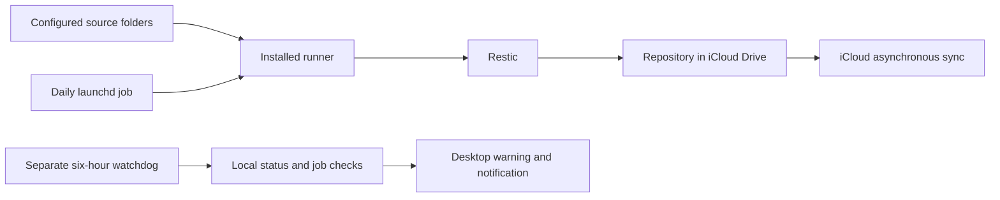

# ADR-001: Password-free Restic repository in iCloud Drive

**Status:** Accepted

**Date:** 2026-09-05

**Decider:** Mac owner

## Context

The previous implementation wrote complete compressed archives and implemented its own retention. The owner wants incremental daily snapshots with 14 daily, 8 weekly, and 24 monthly recovery points, accepts downloading cloud data for recovery, and wants no new password. Available local space is limited. iCloud syncing is trusted and its failures will be handled through iCloud rather than a custom upload monitor. The original source folders are the scope, with Git metadata excluded.

## Decision

Use Restic 0.19.1 or later with `--insecure-no-password` and one repository directly in iCloud Drive. Keep only disposable metadata cache and operational state outside iCloud. Use standard macOS download-on-read behavior. A native eviction test confirmed incremental backup, restored versions/deletions, full checks, and pruning without a permanent local mirror. A small installed Python runner owns scheduling and safety checks; Restic owns storage and calendar retention.

## Options considered

| Option | Benefit | Cost or limitation |
| --- | --- | --- |
| Full compressed archives | Independently readable dated files | Repeated full writes and cloud storage; custom retention |
| Restic directly in iCloud | Mature incremental storage and retention; tested cloud eviction behavior | Shared repository must remain intact; iCloud remote syncing is asynchronous |
| Complete local repository plus upload copy | Easier separation of local operation from cloud transfer | Permanent local space and extra transfer/recovery machinery |
| Kopia or another repository engine | Mature alternative snapshot engines | Switching would require separate eviction and consistency validation |

## Consequences

No separate password, recovery key escrow, transfer service, or iCloud health checker is needed. The whole repository, including internal key metadata, must survive. The system reports local completion without asserting remote upload. A single Mac writes; other Macs restore after syncing. Engine operations can trigger downloads and pause on insufficient space. Monthly cleanup removes wholly unused packs without repacking shared packs, so some obsolete data can remain inside shared files. This does not make asynchronous cloud sync transactional.

Revisit storage cleanup if wasted cloud space becomes significant, and revisit the destination if multiple writers, independently confirmed off-device completion, or strict remote consistency becomes a requirement. Application-consistent database and game backups require application-specific quiet periods or exports.

## References

- [Restic repositories with empty passwords](https://restic.readthedocs.io/en/stable/030_preparing_a_new_repo.html#repositories-with-empty-password)
- [Restic retention](https://restic.readthedocs.io/en/stable/060_forget.html)
- [Apple: Getting ready for dataless files](https://developer.apple.com/documentation/technotes/tn3150-getting-ready-for-data-less-files)
