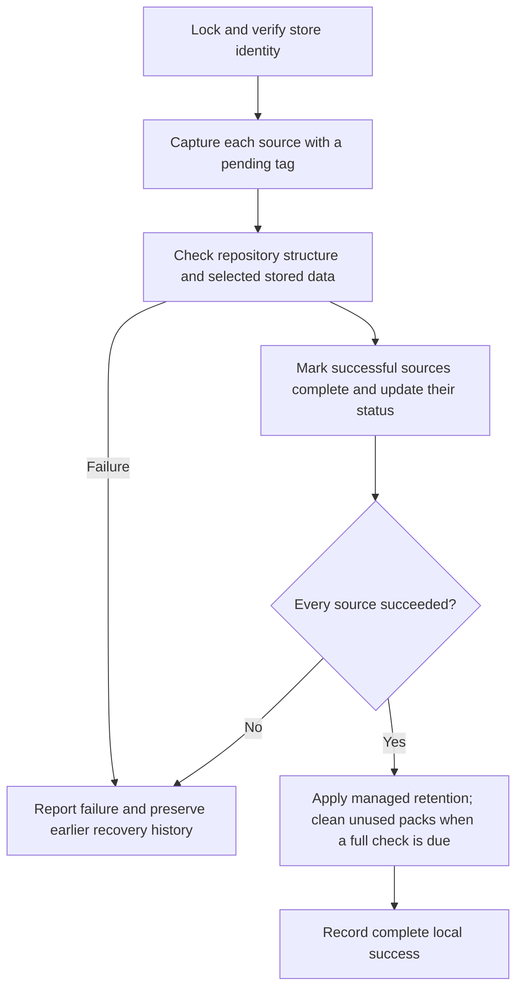

# Architecture

The [storage decision](adr-001-storage.md) records why this design was chosen. This document owns the current component responsibilities, integrity guarantees, and validation scope. Operator procedures belong to [operations](operations.md).

## Responsibilities

| Component | Owns | Delegates |
| --- | --- | --- |
| `icloud_backup.py`: `Config` / `load_config` | Validated private configuration and path boundaries | Installation layout to the installer |
| `icloud_backup.py`: `App` | Backup lifecycle, completion state, local locks, engine guards, source health, and safe restore targets | Storage, snapshot selection, verification, and calendar retention to Restic |
| `install.py` | Stable runtime/shortcut, generated launchd jobs, deployment metadata, migration copies, and recovery export | Backup execution to the installed runner |
| `watch.py` | Independent supervision of `status --json` and fallback alerts | Health rules to the runner while it can run |
| Restic | Content reuse, compression, internal repository format, snapshots, integrity checks, restore, and retention | Remote file synchronization to iCloud Drive |
| iCloud Drive | Asynchronous upload and native download-on-read | Local backup success is reported by the runner |

The watchdog's small file-writing and notification fallback is intentionally independent. Sharing it by importing the runner would prevent it from reporting a broken runner import. Tests exercise that failure boundary. The installer may import the source runner because it is a deployment tool, not the independent monitor.

There are two different repositories: the Git checkout stores application source; the Restic backup store holds recovery data. Neither the local cache nor status is a second complete backup store. See [the ownership map](operations.md#identify-the-active-installation) for exact paths and which copies are authoritative.

## Completion and retention

Every source is captured separately. Missing/empty sources and unreadable files are errors, and only engine exit 0 counts as a successful capture. Healthy sources may still gain checked recovery points when a peer fails, but that cycle skips retention. A pending snapshot is not offered as a completed restore point. Earlier pending snapshots are removed only after checked replacements for the current sources succeed.

The first cycle, a cycle after a recorded failure, and a cycle at least 30 days after the last full check read all stored data. Other cycles check all repository structure plus one of seven data-pack subsets, rotating by UTC date. That sample is not a complete reread and does not necessarily include every newly written pack. Restic additionally verifies data before storing it, and restores use `--verify`. A check failure prevents promotion and retention.

Retention filters on this app's `icloud-backup-v2,complete` tags and groups by original source paths. It must not group by per-run tags, which would prevent old history from expiring. Future-dated completed snapshots beyond a small clock tolerance block retention. Calendar policy details belong to [configuration](configuration.md#retention).

After a full check and successful captures, cleanup uses `prune --max-repack-size 0`, followed by another structural check. It removes wholly unused storage files without repacking shared packs. Obsolete bytes within shared packs can remain, and newly obsolete data can remain until a later cleanup. Revisit this tradeoff if wasted storage becomes significant.

Local `flock` serializes operations that touch the backup store. Restic's stale locks are cleared at the beginning of a backup cycle; active locks are never forcibly removed. Engine children run in their own process group so an interruption or timeout can stop the child. Local JSON state is replaced atomically. A missing or mismatched store identity is an error; ordinary backup runs never initialize a substitute store.

## iCloud and space

Files evicted by iCloud can be downloaded when Restic reads them. Directory listing, metadata inspection, and timestamp changes do not request file contents, so no `touch` sweep is used. Native download behavior was tested on macOS 26.6.2 with Restic 0.19.1; Finder's Download Now remains an operator fallback. Legacy placeholder handling is documented in [configuration](configuration.md#backup-store-and-sources).

This design assumes iCloud will sync. It does not turn a general sync folder into a transactional remote backup store or verify remote upload completion. One Mac writes; other Macs recover after syncing. iCloud can evict data at its discretion, and the app promises no eviction deadline. Full checks, restores, and some maintenance can download substantial data.

The runner checks immediately free local space and a per-engine-command time limit. These checks can stop work visibly; they do not promise that the next write will fit. Finder may report more available space because it includes reclaimable storage. Recovery needs room for both downloaded backup data and restored files. Failure preserves prior good recovery points according to the completion rules above.

File capture is not an atomic filesystem image or application-consistent export. Live databases and active game worlds may require an application export or a quiet period. Normal source files, intended hidden files, and symlinks are covered subject to configured exclusions.

## Validation

The test suite uses temporary data and real empty-password Restic repositories for version/deletion recovery, hidden files, symlinks, exclusions, managed retention, and independent source groups. Calendar tests cover the configured default policy across year and leap-day boundaries. Failure tests combine real repositories with injected read/check/space failures and an interrupted child process, checking that old completed points survive and later runs can recover. Installation tests cover schedule wiring, configuration selection, the watchdog's missing-runner path, and a copied runtime after a fixture checkout is removed.

Manual iCloud tests exercised native eviction, incremental capture, old/deleted-file recovery, full checking, and prune. They also covered native cloud-only source reads. Manual production validation included a scheduled capture and separate verified restores. These observations do not establish physical power-loss behavior, a remote transactional guarantee, or universal compatibility across macOS releases. Private run evidence and machine inventories are intentionally outside this repository.
